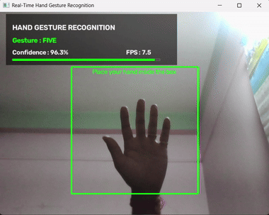

# Real-Time Hand Gesture Recognition


A Python application that recognizes hand gestures in real time from a webcam feed, using a MobileNetV2 classifier that I trained myself and integrated into a live OpenCV pipeline.

## Table of Contents

- [Demo](#demo)
- [Development and Attribution](#development-and-attribution)
- [Skills Demonstrated](#skills-demonstrated)
- [Features](#features)
- [Project Files](#project-files)
- [How It Works](#how-it-works)
- [Setup](#setup)
- [Run](#run)
- [Notes](#notes)
- [Known Limitations](#known-limitations)
- [What I'd Improve Next](#what-id-improve-next)
- [License](#license)

## Demo



## Development and Attribution

I trained the MobileNetV2-based classifier in Google Colab, using a hand-gesture dataset sourced from Kaggle (transfer learning, data preprocessing, and evaluation were all done by me). I also built the entire real-time application around it — webcam integration, image preprocessing, confidence filtering, gesture display, and the smoothing logic that stabilizes predictions frame to frame.

- **Dataset:** [Gestures Hand](https://www.kaggle.com/datasets/kritanjalijain/gestures-hand) by Kaggle user `kritanjalijain`.
- **Model:** MobileNetV2, fine-tuned by me on the dataset above (see `kaggle_mobilenet_model.keras`).

## Skills demonstrated

- **Machine learning:** transfer learning with MobileNetV2, dataset preparation, model training/evaluation, confidence-based inference filtering.
- **Tool integration:** wiring a trained Keras model into a live OpenCV video pipeline, real-time frame preprocessing, and a custom smoothing algorithm to make model output usable in a live UI.
- **Software engineering:** dependency management, error handling around hardware I/O (webcam), and clear documentation for reproducibility.

## Features

- Live webcam prediction
- Eight gesture classes: `fist`, `five`, `none`, `okay`, `peace`, `rad`, `straight`, and `thumbs`
- Confidence filtering to reduce uncertain predictions
- Score-based smoothing to reduce flickering labels
- A centered guide box for consistent hand placement

## Project files

| File | Purpose |
|------|---------|
| `realtime_prediction.py` | Runs webcam-based gesture recognition. |
| `kaggle_mobilenet_model.keras` | Trained MobileNetV2 model. |
| `requirements.txt` | Python packages needed to run the project. |

## How it works

1. Each webcam frame is cropped to the guide box, resized to 96x96, and normalized.
2. The MobileNetV2 model outputs a probability for each of the 8 gesture classes.
3. Predictions below a 0.65 confidence threshold are treated as `none` to reduce false positives.
4. A score-based smoothing system tracks a running score per gesture (incrementing on repeated detections, decaying otherwise) so the displayed label only changes once a gesture has a clear, stable lead — this prevents flickering between labels frame to frame.

## Setup

1. Clone the repository and open its folder in a terminal.
2. Create and activate a virtual environment:

   ```powershell
   python -m venv venv
   .\venv\Scripts\Activate.ps1
   ```

3. Install the dependencies:

   ```powershell
   pip install -r requirements.txt
   ```

## Run

```powershell
python realtime_prediction.py
```

Keep your hand inside the green box. Press `q` to close the webcam window.

## Notes

- Ensure that your webcam is connected and available to the application.
- The `venv` folder is intentionally excluded from Git; each user should create their own environment.

## Known limitations

- Performance depends on your machine: running inference on every frame can cause lower FPS or noticeable lag on slower CPUs or machines without GPU acceleration for TensorFlow.
- The model is sensitive to capture conditions, since it was trained on the Kaggle dataset's specific setup:
  - **Hand pose/orientation** should roughly match how gestures were captured in the training dataset — an unusual angle or partial hand may not classify well.
  - **Background** should be plain and uncluttered; a busy or textured background behind your hand can confuse predictions.
  - **Lighting** should be even; harsh shadows or strong backlighting reduce accuracy.
- Only one hand gesture is tracked at a time, inside the fixed guide box.
- Tested primarily on Windows with the package versions in `requirements.txt`; other OS/Python combinations may require adjustments (especially for `opencv-python` webcam access).

## What I'd improve next

- Retrain with a more diverse dataset (varied backgrounds, lighting, and skin tones) to reduce sensitivity to capture conditions.
- Add hand detection/cropping (e.g. MediaPipe) before classification, instead of relying on a fixed guide box.
- Batch or async inference to decouple prediction speed from display FPS on slower hardware.
- Package as a small desktop app (PyInstaller) so it runs without a Python environment setup.

## License

This project's code is released under the [MIT License](LICENSE). The training dataset is subject to its own terms — see the attribution above.
